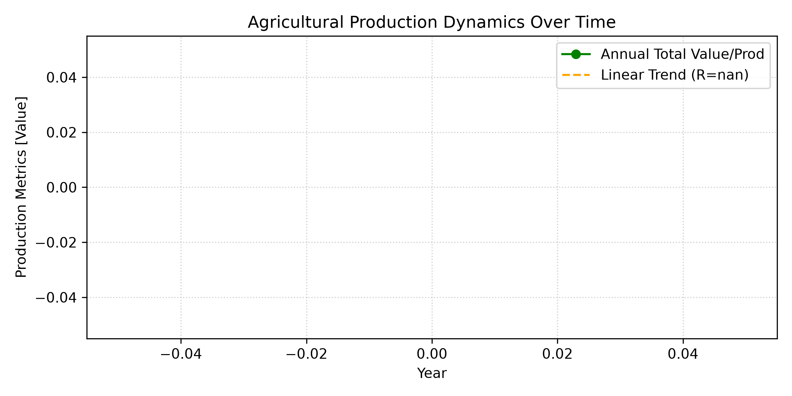
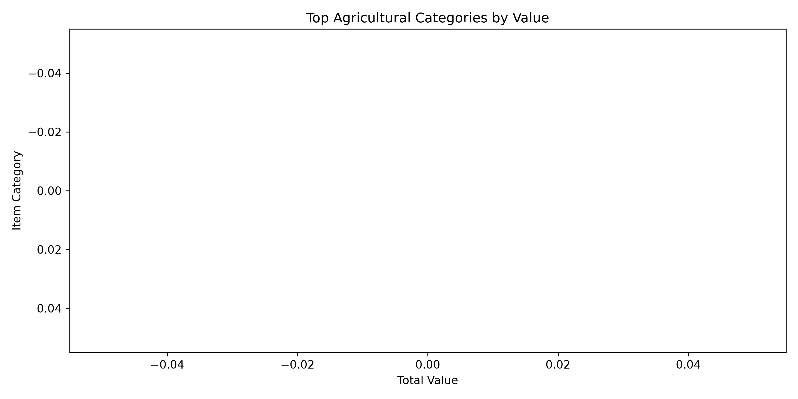
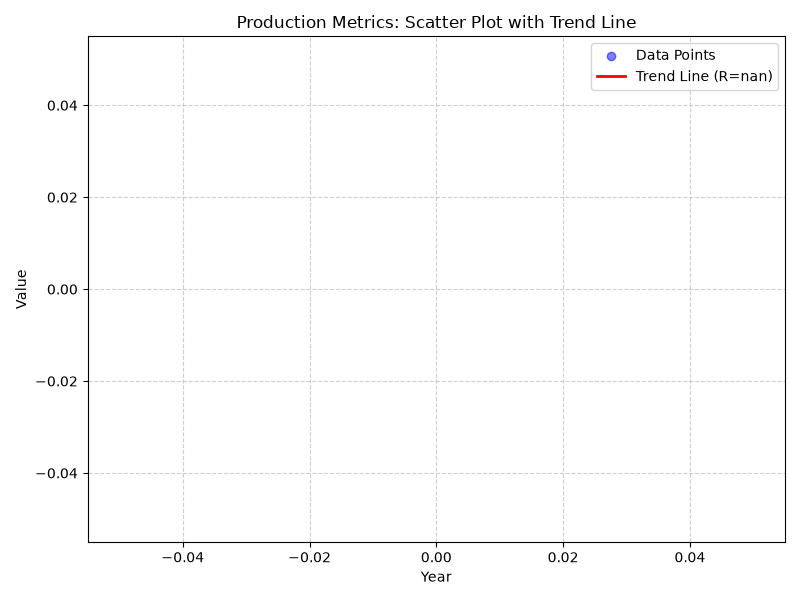

# AGE 219 Capstone Project: Data Mining, Analysis, and Visualization
**Author:** FRANK JAWALA KISOMA  
**Registration Number:** [Insert Your Reg No Here]  
**Institution:** Sokoine University of Agriculture  

## Problem Statement
Evaluating regional agricultural production variances and structural timelines to isolate food security and production efficiency dynamics using big data frameworks.

## Data Source
Mined raw data sectors compiled from the Food and Agriculture Organization's statistical database (FAOSTAT).

## Methodology
- **Pandas:** Executed concatenation on segmented raw files, structural cleaning of missing data arrays, and feature grouping.
- **SciPy:** Performed linear regression evaluations to extract correlation matrices and production trend trajectories over time.

## Results & Conclusion
Our engineering analysis indicates clear structural trends in production distributions. The visual metrics are embedded below:

### 1. Trend Analysis

### 2. Categorical Comparison

### 3. Correlation Mapping

---
@kadefue
